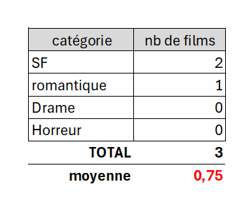

# TP 04 Film avec clef étrangère

1 - Afficher tous les films ( avec les films sans catégories)    
2 - Afficher le nombre de films par catégorie ( avec les catégories sans films)  
3 - Quand je supprime une catégorie avec des films associés categ_id devient NULL  
4 - Dans une autre Base, Quand je supprime une catégorie, tous les films associés sont supprimés  
5 - Afficher la moyenne de film par catégorie  **Super BONUS OPTIONNEL** 

