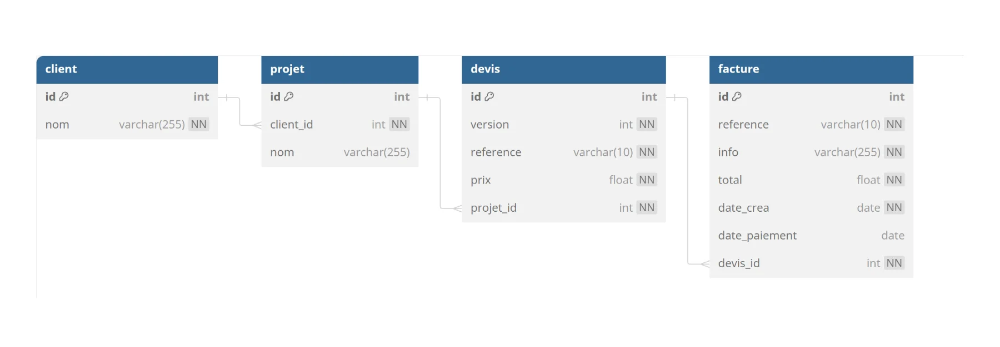

# CRM Customer  Relationship Management
Gestion des devis et factures d'une entreprise
  
**echelle de Scoville 100 000**  :underage:
https://fr.wikipedia.org/wiki/%C3%89chelle_de_Scoville  
3 piments :cactus::cactus::cactus:  
  

## Le pitch :
Le client a un projet  
En fonction du projet , nous lui proposons plusieurs devis  
Il valide un devis  
Nous lui envoyons une facture  
  

## Modele relationnel

## Les Clients

## Les factures

# Partie 1
1 - Créer la base de données  
2 - Ajouter les données  
  
# Partie 2
1 - Afficher toutes les factures avec le nom des clients  
2 - Afficher le nombre de factures par client - afficher 0 factures si il n'y a pas de factures  
3 - afficher le chiffre d'affaire par client   
4 - afficher le CA total  
5 - afficher  la somme des factures en attente de paiement  
6 - afficher les factures en retard de paiment 30 jours max  
avec le nombre de jours de retard  

# Partie 3 réaliser un modèle relationnel
  
:shipit:Réaliser le modèle relationnel sur db diagram  et fournir le prompt
  
https://dbdiagram.io/
