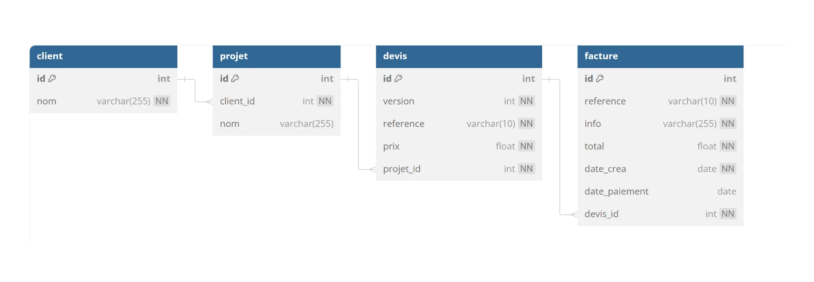
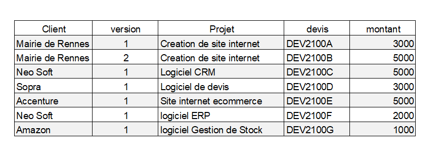
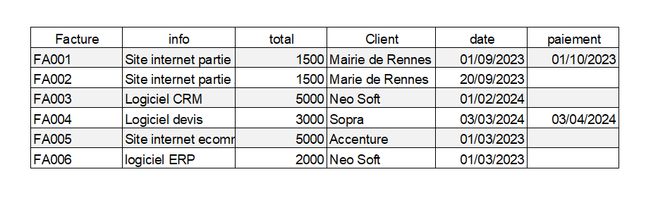

# CRM Customer  Relationship Management
Gestion des devis et factures d'une entreprise
  
**echelle de Scoville 100 000**  :underage:  
https://fr.wikipedia.org/wiki/%C3%89chelle_de_Scoville  
3 piments :cactus::cactus::cactus:  
  

## Le pitch :
Le client a un projet  
En fonction du projet , nous lui proposons plusieurs devis  
Il valide un devis  
Nous lui envoyons une facture  
  

## Modele relationnel

## Les Clients

## Les factures


# Partie 1
1 - Créer la base de données  
2 - Ajouter les données  
  
# Partie 2
1 - Afficher toutes les factures avec le nom des clients  
2 - Afficher le nombre de factures par client - afficher 0 factures si il n'y a pas de factures  
3 - afficher le chiffre d'affaire par client   
4 - afficher le CA total  
5 - afficher  la somme des factures en attente de paiement  
6 - afficher les factures en retard de paiment 30 jours max  
avec le nombre de jours de retard  

# Partie 3 réaliser un modèle relationnel
  
:shipit:Réaliser le modèle relationnel sur db diagram  et fournir le prompt
  
https://dbdiagram.io/


## Correction Partie 1 :heart_eyes: 
## la structure
```mysql
CREATE TABLE `client` (
  `id` int PRIMARY KEY AUTO_INCREMENT,
  `nom` varchar(255) NOT NULL
);

CREATE TABLE `projet` (
  `id` int PRIMARY KEY AUTO_INCREMENT,
  `client_id` int NOT NULL,
  `nom` varchar(255)
);

CREATE TABLE `devis` (
  `id` int PRIMARY KEY AUTO_INCREMENT,
  `version` int NOT NULL,
  `reference` varchar(10) NOT NULL,
  `prix` float NOT NULL,
  `projet_id` int NOT NULL
);

CREATE TABLE `facture` (
  `id` int PRIMARY KEY AUTO_INCREMENT,
  `reference` varchar(10) NOT NULL,
  `info` varchar(255) NOT NULL,
  `total` float NOT NULL,
  `date_crea` date NOT NULL,
  `date_paiement` date,
  `devis_id` int NOT NULL
);

ALTER TABLE `projet` ADD FOREIGN KEY (`client_id`) REFERENCES `client` (`id`);

ALTER TABLE `devis` ADD FOREIGN KEY (`projet_id`) REFERENCES `projet` (`id`);

ALTER TABLE `facture` ADD FOREIGN KEY (`devis_id`) REFERENCES `devis` (`id`);
```

## Les data
```mysql
DELETE FROM client;
DELETE FROM projet;
DELETE FROM devis;
DELETE FROM facture;

INSERT INTO client (nom) VALUES 
	('Mairie de Rennes'),
	('Neo Soft'),
	('Sopra'),
	('Accenture'),
	('Amazon');
INSERT INTO projet (nom, client_id) VALUES
	('Création de site internet', 1),
	('Logiciel CRM', 2),
	('Logiciel de devis', 3),
	('Site internet e-commerce', 4),
	('Logiciel ERP', 2),
	('Logiciel gestion de stock',4);

INSERT INTO devis (version,reference, prix, projet_id) VALUES
	('1','DEV2100A', 3000, 1),
	('2','DEV2100B', 5000, 1),
	('1','DEV2100C', 5000, 2),
	('1','DEV2100D', 3000, 3),
	('1','DEV2100E', 5000, 4),
	('1','DEV2100F', 2000, 5),
	('1','DEV2100G', 1000, 6);

INSERT INTO facture (reference,info,total,devis_id,date_crea,date_paiement)	
    VALUES
	('FA001', 'site internet partie 1', 1500, 1, '2023-09-01','2023-10-01'),
	('FA002', 'site internet partie 2', 1500, 1, '2023-09-20',null),
	('FA003', 'logiciel CRM', 5000, 3, '2024-02-01',null),
	('FA004', 'logiciel devis', 3000, 4, '2024-03-03','2024-04-03'),
	('FA005', 'site ecommerce', 5000, 5, '2024-04-01',null),
	('FA006', 'logiciel ERP', 2000, 6, '2024-04-01',null);

```
