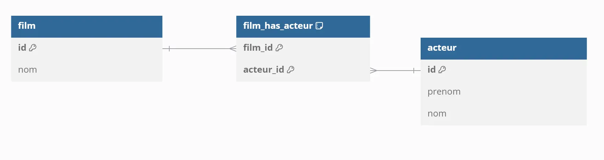
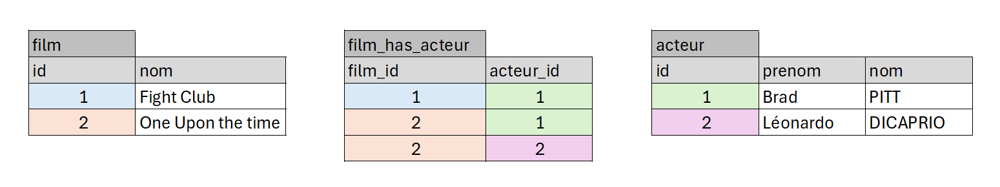

# La table de jointure

## Le modèle relationnel


## Les données


## DB diagram
```

Table "film" {
  "id" INT [pk, not null, increment]
  "nom" VARCHAR(100) [not null]
}

Table "acteur" {
  "id" INT [pk, not null, increment]
  "prenom" VARCHAR(100) [not null]
  "nom" VARCHAR(100) [not null]
}

Table "film_has_acteur" {
  "film_id" INT [not null]
  "acteur_id" INT [not null]

  Indexes {
    (film_id, acteur_id) [pk]
  }
}

Ref "fk_acteur":"acteur"."id" < "film_has_acteur"."acteur_id"

Ref "fk_film":"film"."id" < "film_has_acteur"."film_id"

```

## La Base de données
```mysql
CREATE TABLE film (
  id INT  NOT NULL AUTO_INCREMENT,
  nom VARCHAR(100) NOT NULL,
  CONSTRAINT pk_film PRIMARY KEY(id)
)ENGINE=INNODB;

CREATE TABLE acteur (
  id INT NOT NULL AUTO_INCREMENT,
  prenom VARCHAR(100) NOT NULL,
  nom VARCHAR(100) NOT NULL,
   CONSTRAINT pk_acteur PRIMARY KEY(id)
)ENGINE=INNODB;

CREATE TABLE film_has_acteur (
  film_id INT NOT NULL,
  acteur_id INT NOT NULL,
  CONSTRAINT pk_film_has_acteur PRIMARY KEY (film_id, acteur_id)
)ENGINE=INNODB;

ALTER TABLE film_has_acteur ADD CONSTRAINT fk_acteur FOREIGN KEY (acteur_id) REFERENCES acteur (id);
ALTER TABLE film_has_acteur ADD CONSTRAINT fk_film FOREIGN KEY (film_id) REFERENCES film (id);
```
## les données
```mysql
INSERT INTO acteur (id, prenom, nom) VALUES
(1, 'Brad', 'PITT'),
(2, 'Léonardo', 'Dicaprio');

INSERT INTO film (id, nom) VALUES
(1, 'Fight Club'),
(2, 'Once Upon a time in Hollywood');

INSERT INTO film_has_acteur 
(film_id, acteur_id) 
VALUES 
('1', '1'), 
('2', '1'), 
('2', '2');
```

# Afficher tous les films et leur acteurs
```mysql
SELECT 
film.nom AS film,
acteur.prenom,
acteur.nom
FROM film
INNER JOIN film_has_acteur  ON film.id = film_has_acteur.film_id
INNER JOIN acteur ON acteur.id = film_has_acteur.acteur_id
```


# Afficher tous les films Léonardo
```mysql
SELECT 
film.nom AS film,
acteur.prenom,
acteur.nom
FROM film
INNER JOIN film_has_acteur  ON film.id = film_has_acteur.film_id
INNER JOIN acteur ON acteur.id = film_has_acteur.acteur_id
WHERE acteur_id=1
```