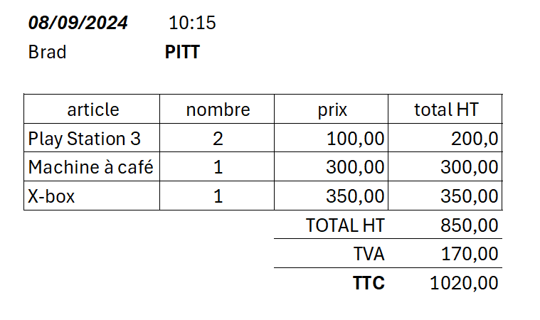

# TP 7 SITE E-commerce


# La base de données
```mysql
CREATE TABLE client (
  id INT NOT NULL AUTO_INCREMENT,
  nom VARCHAR(100) NOT NULL,
  prenom VARCHAR(100),
  CONSTRAINT pk_client PRIMARY KEY pk_client(id)
)ENGINE=INNODB;

CREATE TABLE commande (
  id INT NOT NULL AUTO_INCREMENT,
  date_achat DATETIME NOT NULL,
  client_id int NOT NULL,
  CONSTRAINT pk_commande PRIMARY KEY  pk_commande(id)
)ENGINE=INNODB;

CREATE TABLE article (
  id INT NOT NULL AUTO_INCREMENT,
  nom VARCHAR(100) NOT NULL,
  prix float NOT NULL,
   CONSTRAINT pk_article PRIMARY KEY  pk_article(id)
)ENGINE=INNODB;

-- ajouter la table ligne ...

ALTER TABLE commande ADD FOREIGN KEY (client_id) REFERENCES client (id);
```

## Partie 1 - Objectifs
 1- Ajouter la table ligne

## Partie 2 - Objectifs 
1 - Insérer les données  

### la table article
| id | nom | prix | 
|----|---|---|
| 1 | PlayStation 5 | 400.00 |
| 2 | X box | 350.00 |
| 3 | Machine à café | 300.00 |
| 4 | PlayStation 3 | 100.00 |

### la table client
| id | nom | prenom | 
|----|---|---|
| 1 | Brad | PITT |
| 2 | George | Cloney |
| 3 | Jean | DUJARDIN |


### la table commande
| id | date_achat | client_id | 
|----|---|---|
| 1 | 08/09/2024 | 1 |

### la table ligne
***En fonction de la commande de Brad PITT***
  
   


## Partie 3 - Objectifs 
1 - Afficher la commande de Brad PITT
