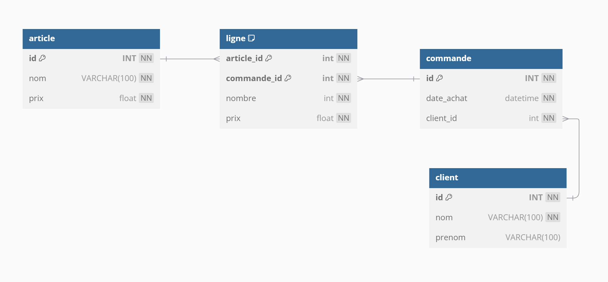

# TP 7 SITE E-commerce




# La base de données
```mysql
CREATE TABLE client (
  id INT NOT NULL AUTO_INCREMENT,
  nom VARCHAR(100) NOT NULL,
  prenom VARCHAR(100),
  CONSTRAINT pk_client PRIMARY KEY pk_client(id)
)ENGINE=INNODB;

CREATE TABLE commande (
  id INT NOT NULL AUTO_INCREMENT,
  date_achat DATETIME NOT NULL,
  client_id int NOT NULL,
  CONSTRAINT pk_commande PRIMARY KEY  pk_commande(id)
)ENGINE=INNODB;

CREATE TABLE article (
  id INT NOT NULL AUTO_INCREMENT,
  nom VARCHAR(100) NOT NULL,
  prix float NOT NULL,
   CONSTRAINT pk_article PRIMARY KEY  pk_article(id)
)ENGINE=INNODB;

-- ajouter la table ligne ...

ALTER TABLE commande ADD FOREIGN KEY (client_id) REFERENCES client (id);
```

## Partie 1 - Objectifs
 1- Ajouter la table ligne

## Partie 2 - Objectifs 
1 - Insérer les données  

### la table article
| id | nom | prix | 
|----|---|---|
| 1 | PlayStation 5 | 400.00 |
| 2 | X box | 350.00 |
| 3 | Machine à café | 300.00 |
| 4 | PlayStation 3 | 100.00 |

### la table client
| id | nom | prenom | 
|----|---|---|
| 1 | Brad | PITT |
| 2 | George | Cloney |
| 3 | Jean | DUJARDIN |


### la table commande
| id | date_achat | client_id | 
|----|---|---|
| 1 | 08/09/2024 | 1 |

### la table ligne
***En fonction de la commande de Brad PITT***
  
   


## Partie 3 - Objectifs 
1 - Afficher la commande de Brad PITT


# db diagram  - correction :heart_eyes:
```
Table client {
  id INT [pk, not null, increment]
  nom VARCHAR(100) [not null]
  prenom VARCHAR(100)
}

Table commande {
  id INT [pk, not null, increment]
  date_achat datetime [not null]
  client_id int [not null] 
}
Table article {
  id INT [pk, not null, increment]
  nom VARCHAR(100) [not null]
  prix float [not null]
}
Table ligne {
  article_id int  [not null,pk]
  commande_id int  [not null,pk]
  nombre int [not null]
  prix float [not null]

}

Ref: "article"."id" < "ligne"."article_id"

Ref: "commande"."id" < "ligne"."commande_id"

Ref: "client"."id" < "commande"."client_id"
```

# Partie 1 - correction :heart_eyes: :

```mysql
CREATE TABLE ligne (
  article_id int NOT NULL,
  commande_id int NOT NULL,
  nombre int NOT NULL,
  prix float NOT NULL,
  CONSTRAINT pk_ligne PRIMARY KEY (article_id, commande_id)
)ENGINE=INNODB;
-- à la fin ...

ALTER TABLE ligne ADD FOREIGN KEY (article_id) REFERENCES article (id);
ALTER TABLE ligne ADD FOREIGN KEY (commande_id) REFERENCES commande (id);

```
# la structure complète de la base
```mysql
CREATE TABLE client (
  id INT NOT NULL AUTO_INCREMENT,
  nom VARCHAR(100) NOT NULL,
  prenom VARCHAR(100),
  CONSTRAINT pk_client PRIMARY KEY  pk_client(id)
)ENGINE=INNODB;

CREATE TABLE commande (
  id INT NOT NULL AUTO_INCREMENT,
  date_achat DATETIME NOT NULL,
  client_id int NOT NULL,
  CONSTRAINT pk_commande PRIMARY KEY  pk_commande(id)
)ENGINE=INNODB;

CREATE TABLE article (
  id INT NOT NULL AUTO_INCREMENT,
  nom VARCHAR(100) NOT NULL,
  prix float NOT NULL,
   CONSTRAINT pk_article PRIMARY KEY  pk_article(id)
)ENGINE=INNODB;

CREATE TABLE ligne (
  article_id int NOT NULL,
  commande_id int NOT NULL,
  nombre int NOT NULL,
  prix float NOT NULL,
  CONSTRAINT pk_ligne PRIMARY KEY (article_id, commande_id)
)ENGINE=INNODB;

ALTER TABLE commande ADD FOREIGN KEY (client_id) REFERENCES client (id);

ALTER TABLE ligne ADD FOREIGN KEY (article_id) REFERENCES article (id);
ALTER TABLE ligne ADD FOREIGN KEY (commande_id) REFERENCES commande (id);
```

# les données :
```mysql
-- article
INSERT INTO article (nom,prix) VALUES
('PlayStation 5',	400),
('X box',	350),
('Machine à café',	400),
('PlayStation 3',	100);

-- client
INSERT INTO client (nom,prenom) VALUES
('Brad','PITT'),	
('George','CLONEY'),
('Jean','DUJARDIN');

-- commande
INSERT INTO commande (date_achat,client_id) VALUES('2024/09/08 10:15:00',1);

-- ligne
INSERT INTO ligne (article_id,commande_id,nombre,prix) VALUES
(4,1,2,100),
(3,1,1,300),
(2,1,1,350);

```

# Afficher la commande
```mysql
SELECT 
client.prenom AS prenom,
client.nom AS nom,
commande.date_achat as date_achat,
article.nom AS nom,
ligne.prix AS prix,
ligne.nombre AS nb,
ligne.prix*ligne.nombre AS total
FROM
commande
INNER JOIN ligne ON commande.id = ligne.commande_id
INNER JOIN article ON article_id= article.id
INNER JOIN client ON client.id = commande.client_id
WHERE commande_id=1;

-- le TOTAL
SELECT 
 SUM(ligne.prix*ligne.nombre) AS total_ht,
 SUM(ligne.prix*ligne.nombre*0.2) AS total_tva,
 SUM(ligne.prix*ligne.nombre*1.2) AS total_ttc
FROM
commande
INNER JOIN ligne ON commande.id = ligne.commande_id
WHERE commande_id=1;
```
